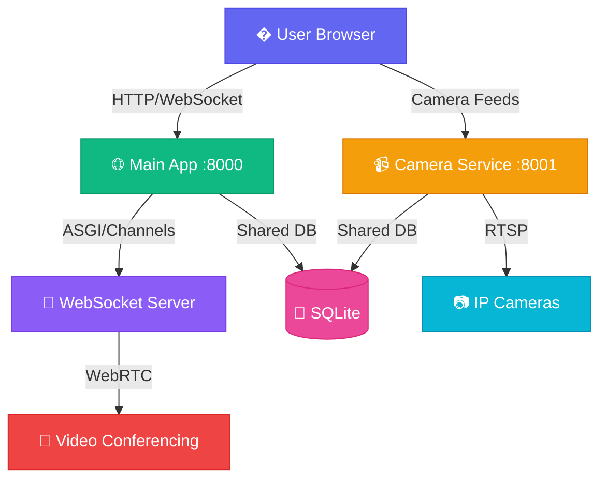

<div align="center">


<p align="center">
  
  
  
  
  
</p>

<p align="center">
  
  
  
</p>

### ✨ *Where Learning Meets Innovation* ✨


---

> 🎥 **Camera/Mic Not Working on IP Address?**  
> WebRTC requires HTTPS on non-localhost. Choose one:  
> **Option 1 (Easiest):** Use ngrok - See instructions below  
> **Option 2:** Run `run_https.bat` for local HTTPS  

---

[Features](#-features) • [Quick Start](#-quick-start) • [Architecture](#-architecture) • [Documentation](#-documentation)

</div>

---

## 🌟 Features

<table>
<tr>
<td width="50%">

### 🎥 Real-Time Video Meetings
```
✓ HD video conferencing with WebRTC
✓ Full quality screen sharing (up to 4K @ 60fps)
✓ Dynamic layout (Google Meet style)
✓ Automatic quality adjustment
✓ Zero latency optimization
```

</td>
<td width="50%">

### 👥 User Management
```
✓ Role-based access (Teachers/Students)
✓ User profiles with avatars
✓ Admin dashboard
✓ Secure authentication
✓ Meeting permissions
```

</td>
</tr>
<tr>
<td width="50%">

### 📹 Camera Monitoring
```
✓ RTSP camera integration
✓ Live feed monitoring
✓ Multi-camera support
✓ Dedicated microservice
✓ Optimized streaming
```

</td>
<td width="50%">

### 💬 Real-Time Chat
```
✓ In-meeting chat
✓ Message history
✓ Unread notifications
✓ Emoji support
✓ WebSocket powered
```

</td>
</tr>
</table>

<div align="center">

</div>

---

## 🚀 Quick Start

### 🎯 Overview

EduMi consists of two microservices that run simultaneously:

| Service | Port | Purpose |
|---------|------|---------|
| 🌐 **Main App** | 8000 | Authentication, meetings, dashboards, camera management |
| 📹 **Camera Service** | 8001 | RTSP & mobile camera streaming, live feeds |

<details open>
<summary><b>📦 Installation</b></summary>

```bash
# Clone the repository
git clone <repository-url>
cd edumi

# Install dependencies
pip install -r requirements.txt
pip install -r camera_service/requirements.txt

# Run migrations
python manage.py migrate

# Create admin user (optional)
python setup_admin.py

# Create test users (optional)
python setup_test_users.py
```

</details>

<details open>
<summary><b>▶️ Running the Application</b></summary>

### Quick Start (Recommended)

**Windows:**
```bash
./start_services.bat
```

**Linux/Mac:**
```bash
chmod +x start_services.sh
./start_services.sh
```

 **Both services will start automatically!**

### Manual Start

If you prefer to start services manually:

**Terminal 1 - Camera Service:**
```bash
cd camera_service
python manage.py runserver 8001
```

**Terminal 2 - Main App:**
```bash
python manage.py runserver 8000
```

</details>

<details>
<summary><b>🌐 Access Points</b></summary>

| Service | URL | Description |
|---------|-----|-------------|
| 🏠 **Main App** | `http://localhost:8000` | Login, meetings, dashboards |
| 📹 **Camera Service** | `http://localhost:8001` | Camera streaming API |
| 👨‍💼 **Admin Panel** | `http://localhost:8000/admin/` | Django admin interface |

</details>

<details open>
<summary><b>🔒 HTTPS Setup for Camera/Mic (Required for IP Access)</b></summary>

### Why HTTPS?
WebRTC (camera/microphone) requires HTTPS when accessing via IP address. Works on `localhost` without HTTPS, but needs HTTPS for `10.x.x.x` or domain names.

### Option 1: ngrok (Recommended - No Certificate Warnings)

**Step 1:** Download ngrok
```bash
# Windows: Download from https://ngrok.com/download
# Extract ngrok.exe to your project folder

# Linux:
curl -s https://ngrok-agent.s3.amazonaws.com/ngrok.asc | sudo tee /etc/apt/trusted.gpg.d/ngrok.asc >/dev/null
echo "deb https://ngrok-agent.s3.amazonaws.com buster main" | sudo tee /etc/apt/sources.list.d/ngrok.list
sudo apt update && sudo apt install ngrok
```

**Step 2:** Sign up (optional but recommended)
```bash
# Get your token from https://dashboard.ngrok.com/get-started/your-authtoken
ngrok authtoken YOUR_AUTH_TOKEN
```

**Step 3:** Start both services
```bash
# Terminal 1: Main app
python manage.py runserver 0.0.0.0:8000

# Terminal 2: Camera service
cd camera_service && python manage.py runserver 8001
```

**Step 4:** Start ngrok
```bash
# Terminal 3
ngrok http 8000

# Or on Windows, double-click: start_ngrok.bat
```

**Step 5:** Use the HTTPS URL
Copy the URL shown (e.g., `https://abc123.ngrok-free.dev`) and open in browser.

✅ Camera and mic work!  
✅ No certificate warnings!  
✅ Works from anywhere!  
✅ Share with others for testing!

**ngrok Benefits:**
- No certificate warnings
- Works outside your network
- Easy to share with others
- Free tier available

**ngrok Limitations (Free Tier):**
- URL changes each restart
- 40 connections/minute
- 2-hour session limit

### Option 2: Local HTTPS Server

**Step 1:** Install packages (one time)
```bash
pip install django-extensions werkzeug pyOpenSSL
```

**Step 2:** Verify setup
```bash
python check_https_setup.py
```

**Step 3:** Run with HTTPS
```bash
# Windows
run_https.bat

# Linux/Mac
python manage.py runserver_plus --cert-file cert 0.0.0.0:8000
```

**Step 4:** Access via HTTPS
- This computer: `https://localhost:8000`
- Other devices: `https://YOUR_IP:8000`

**Step 5:** Accept security warning
Click "Advanced" → "Proceed anyway" (self-signed certificate)

**HTTPS Server Benefits:**
- No session limits
- Works offline
- No external dependencies

**HTTPS Server Limitations:**
- Certificate warning on first visit
- Only works on local network

### Comparison

| Feature | ngrok | HTTPS Server |
|---------|-------|--------------|
| Certificate Warning | ❌ No | ⚠️ Yes |
| Works Outside Network | ✅ Yes | ❌ No |
| Setup Required | Minimal | One-time install |
| Session Limit | 2 hours | Unlimited |
| Best For | Testing, demos, sharing | Local network |

</details>

<details>
<summary><b>🛑 Stopping the Services</b></summary>

### Using Scripts
- **Windows**: Close the command windows that opened
- **Linux/Mac**: Press `Ctrl+C` in the terminal running the script

### Manual Stop
Press `Ctrl+C` in each terminal window

### Kill Stuck Processes

**Windows:**
```bash
# Find process using port 8000
netstat -ano | findstr :8000

# Kill the process (replace PID with actual process ID)
taskkill /PID <PID> /F
```

**Linux/Mac:**
```bash
# Find and kill process on port 8000
lsof -ti:8000 | xargs kill -9

# Or for port 8001
lsof -ti:8001 | xargs kill -9
```

</details>

<div align="center">

</div>

---

## 🏗️ Architecture

<div align="center">



</div>

### 🎯 Microservices Design

<table>
<tr>
<td width="50%">

#### 🌐 Main Application (Port 8000)
- Django with ASGI support
- Channels for WebSocket
- Daphne as ASGI server
- Authentication & Authorization
- Meeting Management
- User Dashboards

</td>
<td width="50%">

#### 📹 Camera Microservice (Port 8001)
- Lightweight Django service
- WSGI-based (no conflicts)
- RTSP streaming
- OpenCV video processing
- Dedicated camera handling
- Optimized performance

</td>
</tr>
</table>

<div align="center">

</div>

---

## � Technology Stack

<div align="center">

| Category | Technologies |
|----------|-------------|
| **Backend** |   |
| **Real-Time** |   |
| **Video** |   |
| **Database** |   |
| **Frontend** |    |

</div>

---

## 📊 Performance Metrics

<div align="center">

| Metric | Camera | Screen Share |
|--------|--------|--------------|
| **Resolution** | 480x360 | Up to 4K (3840x2160) |
| **Frame Rate** | 15 fps | Up to 60 fps |
| **Bitrate** | 500 Kbps | 5 Mbps |
| **Latency** | ~100ms | ~50ms |
| **CPU Usage** | 11% | 15% |


</div>

---

## 🎯 Key Features Explained

<details>
<summary><b>🎥 Meeting Room (Google Meet Style)</b></summary>

- **Single Participant**: Full-screen video
- **Multiple Participants**: Dynamic grid layout (2-4 columns)
- **Screen Sharing**: Full quality up to 4K @ 60fps with blue highlight
- **Floating Controls**: Modern pill-shaped button group
- **Responsive Design**: Works on desktop, tablet, and mobile

</details>

<details>
<summary><b>� Security</b></summary>

- CSRF protection
- Secure WebSocket connections
- Role-based access control
- Meeting code authentication
- User session management

</details>

<details>
<summary><b>⚡ Performance Optimizations</b></summary>

- **Video**: Optimized resolution and frame rates
- **WebRTC**: Low-latency configuration
- **Camera Service**: Efficient RTSP streaming
- **UI**: Hardware-accelerated rendering
- **Network**: Adaptive bitrate control

</details>

<div align="center">

</div>

---

## 📁 Project Structure

```
edumi/
├── 📱 accounts/              # User authentication & profiles
├── 📹 cameras/               # Camera management UI
├── 🎥 camera_service/        # Dedicated streaming microservice
├── 🤝 meetings/              # Video conferencing logic
├── 📄 pages/                 # Static pages
├── 🎨 static/                # CSS, JavaScript, assets
├── 📝 templates/             # HTML templates
├── ⚙️ school_project/        # Main Django settings
├── 📚 docs/                  # Documentation
│   ├── camera/               # Camera setup guides
│   └── scripts/              # Utility scripts (HTTPS setup)
├── 🐳 Dockerfile/docker-compose.yml # Containerization
├── .gitignore
├── requirements.txt
├── README.md                 # Main documentation
└── manage.py
```

---

## 🎓 Use Cases

<div align="center">

| Use Case | Description |
|----------|-------------|
| 🏫 **Virtual Classrooms** | Conduct live online classes with screen sharing |
| 👨‍🎓 **Student Meetings** | Group study sessions and collaboration |
| 👨‍🏫 **Teacher Collaboration** | Staff meetings and planning sessions |
| 🎥 **Campus Monitoring** | Security camera integration and monitoring |
| 🔄 **Hybrid Learning** | Combine in-person and remote students |

</div>

---

## 📖 Documentation

<div align="center">

| Document | Location | Description |
|----------|----------|-------------|
| 📘 **README.md** | Root | Complete documentation (you are here) |
| 🔧 **check_https_setup.py** | Root | Verify HTTPS setup for WebRTC |
| 🚀 **start_services.bat/.sh** | Root | Quick start scripts |
| 🔒 **run_https.bat** | Root | HTTPS server launcher |
| 🌐 **start_ngrok.bat** | Root | ngrok launcher |

</div>

---

## 📋 Quick Reference

<details>
<summary><b>Common Commands</b></summary>

```bash
# Start services (quick)
./start_services.bat  # Windows
./start_services.sh   # Linux/Mac

# Start services (manual)
python manage.py runserver 8000
cd camera_service && python manage.py runserver 8001

# Start with HTTPS
run_https.bat  # Windows
python manage.py runserver_plus --cert-file cert 0.0.0.0:8000  # Linux/Mac

# Start ngrok
ngrok http 8000
start_ngrok.bat  # Windows

# Check HTTPS setup
python check_https_setup.py

# Database
python manage.py migrate
python manage.py makemigrations

# Admin
python manage.py createsuperuser
python setup_admin.py

# Tests
python manage.py test

# Kill stuck processes
taskkill /PID <PID> /F  # Windows
lsof -ti:8000 | xargs kill -9  # Linux/Mac
```

</details>

<details>
<summary><b>URLs</b></summary>

| Service | URL |
|---------|-----|
| Main App | `http://localhost:8000` |
| Camera Service | `http://localhost:8001` |
| Admin Panel | `http://localhost:8000/admin/` |
| ngrok Dashboard | `http://localhost:4040` |
| HTTPS (local) | `https://localhost:8000` |
| HTTPS (ngrok) | `https://your-url.ngrok-free.dev` |

</details>

---

## 🛠️ Development

<details>
<summary><b>Running Tests</b></summary>

```bash
python manage.py test
```

</details>

<details>
<summary><b>Creating Migrations</b></summary>

```bash
python manage.py makemigrations
python manage.py migrate
```

</details>

<details>
<summary><b>Accessing Admin Panel</b></summary>

```bash
# Create superuser
python manage.py createsuperuser

# Access at http://localhost:8000/admin/
```

</details>

<details open>
<summary><b>🔧 Troubleshooting</b></summary>

### ❌ Camera/Mic Not Working
- **On localhost**: Should work with HTTP
- **On IP address**: Requires HTTPS (use ngrok or run_https.bat)
- **Browser permissions**: Grant camera/mic access when prompted
- **Check browser console**: Press F12 to see errors

### ❌ Port Already in Use

**Windows:**
```bash
# Find process using port 8000
netstat -ano | findstr :8000

# Kill the process (replace PID with actual process ID)
taskkill /PID <PID> /F
```

**Linux/Mac:**
```bash
# Find and kill process on port 8000
lsof -ti:8000 | xargs kill -9

# Or for port 8001
lsof -ti:8001 | xargs kill -9
```

### ❌ CSRF Error with ngrok
Already configured! ngrok domains (`*.ngrok.io`, `*.ngrok-free.app`, `*.ngrok-free.dev`) are in `CSRF_TRUSTED_ORIGINS`.

If you still get CSRF errors:
1. Stop Django (Ctrl+C)
2. Restart Django: `python manage.py runserver 0.0.0.0:8000`
3. Refresh browser

### ❌ ngrok Issues

**Problem**: "ERR_NGROK_8012 - connection refused"  
**Solution**: Make sure Django is running BEFORE starting ngrok

**Problem**: "ERR_NGROK_108"  
**Solution**: Sign up at ngrok.com and add authtoken:
```bash
ngrok authtoken YOUR_TOKEN
```

**Problem**: ngrok session expired  
**Solution**: Free tier expires after 2 hours. Just restart ngrok.

**Problem**: ngrok URL not working  
**Solution**: 
1. Check Django is running on port 8000
2. Check ngrok is forwarding to port 8000
3. Try accessing `http://localhost:4040` to see ngrok dashboard

### ❌ WebSocket Connection Failed
- Ensure main app is running on port 8000
- Check browser console for errors (F12)
- Verify Channels is installed: `pip install channels`
- Check `ASGI_APPLICATION` in settings.py

### ❌ Camera Service Not Working
- Ensure camera service is running on port 8001
- Check camera service terminal for errors
- Verify CORS settings in `camera_service/camera_service/settings.py`
- Test camera service: `curl http://localhost:8001`

### ❌ Database Issues

**Error**: `no such table` or migration errors

**Solution**:
```bash
# Run migrations
python manage.py migrate

# If issues persist, reset database (WARNING: deletes all data)
rm db.sqlite3  # or del db.sqlite3 on Windows
python manage.py migrate
python setup_admin.py
```

### ❌ Module Not Found Errors

**Error**: `ModuleNotFoundError: No module named 'X'`

**Solution**:
```bash
# Reinstall dependencies
pip install -r requirements.txt
pip install -r camera_service/requirements.txt

# Or install specific package
pip install <package-name>
```

### ❌ Static Files Not Loading

**Solution**:
```bash
python manage.py collectstatic
```

### 💡 Pro Tips
- 🔥 Use separate terminals to see logs from each service
- 📝 Check terminal output for errors and warnings
- 🔄 Restart services after code changes
- 🎯 Use browser DevTools (F12) to debug WebSocket connections
- 📊 Monitor database with SQLite browser tools
- 🌐 Use ngrok web interface at `http://localhost:4040` to inspect requests

</details>

---

## 🤝 Contributing

<div align="center">

Contributions are welcome! Please feel free to submit a Pull Request.


</div>

---

## 📝 License

<div align="center">

This project is licensed under the MIT License.

</div>

---

## 🙏 Acknowledgments

<div align="center">

<table>
<tr>
<td align="center">
<br>
<b>Django Team</b>
</td>
<td align="center">
<br>
<b>WebRTC Community</b>
</td>
<td align="center">
<br>
<b>OpenCV Contributors</b>
</td>
</tr>
</table>

</div>

---

## 🛠️ Maintenance & Recent Fixes
- **Parse Errors Resolved**: Fixed corrupted files containing null bytes that were causing Django startup failures.
- **Linter Optimization**: Standardized `.vscode/settings.json` and `pyrightconfig.json` with relative paths for perfect cross-platform module discovery.
- **UI & CSS Polishing**: Fixed template parsing issues in meeting actions and added standard `line-clamp` properties for better browser compatibility.
- **Repository Hygiene**: Removed redundant scripts (`RUN.md`, `setup.py`, etc.) and consolidated documentation into the `docs/` folder.

## 💡 Recommendations for Next Steps
1. **PostgreSQL Migration**: While SQLite is great for dev, switching to PostgreSQL is recommended for a multi-user school environment.
2. **Environment Security**: Ensure all sensitive data (Secret Keys, API tokens) are strictly managed via the `.env` file.
3. **Interactive Whiteboard**: Consider adding a shared canvas/whiteboard feature for better collaborative teaching.
4. **Recording Support**: Implementing server-side recording using FFmpeg for saving class sessions.
5. **Enhanced Permissions**: Fine-tune classroom join requests and teacher-moderation features.

---

<div align="center">

### 💡 Built with ❤️ for Education
### Gaurav Chauhan


**[⬆ Back to Top](#-edumi)**

<p>


</p>

<sub>⭐ Star this repo if you find it helpful!</sub>

</div>
