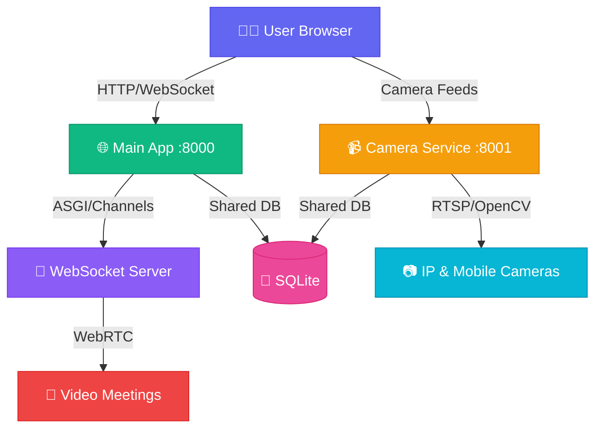

<div align="center">


<p align="center">
  
  
  
  
  
</p>

<p align="center">
  
  
  
</p>

### ✨ *Where Learning Meets Innovation* ✨


---

> 🎥 **Camera/Mic Not Working on IP Address?**  
> WebRTC requires HTTPS on non-localhost. Use **ngrok** (Option 1) or **run_https.bat** (Option 2) for local network testing.

---

[Features](#-features) • [Quick Start](#-quick-start) • [Installation](#-installation) • [Architecture](#-architecture) • [Troubleshooting](#-troubleshooting)

</div>

---

## 🌟 Features

<table>
<tr>
<td width="50%">

### 👥 AI Attendance & Monitoring
```
✓ Face Recognition powered attendance
✓ Real-time focus tracking
✓ Presence detection (Cumulative verification)
✓ Secure face encryption
✓ Headcount monitoring service
```

</td>
<td width="50%">

### 🎥 Real-Time Video Meetings
```
✓ HD video conferencing via WebRTC
✓ Screen sharing (4K @ 60fps support)
✓ Dynamic Google Meet style layout
✓ In-meeting chat & emoji support
✓ Optimized for zero latency
```

</td>
</tr>
<tr>
<td width="50%">

### 📹 Camera Management
```
✓ RTSP & IP Camera integration
✓ Dedicated camera microservice
✓ Multi-camera live-feed monitoring
✓ OpenCV optimized processing
✓ Mobile camera support (DroidCam/IP Webcam)
```

</td>
<td width="50%">

### 🔐 Advanced User Control
```
✓ Role-based access (Teacher/Student/Admin)
✓ Secure Django auth with Staff/Superuser
✓ Meeting permissions & codes
✓ Detailed user profiles with bio/avatars
✓ Interactive admin dashboard
```

</td>
</tr>
</table>

<div align="center">

</div>

---

## 🚀 Quick Start (Windows)

The simplest way to run **Edumi2** on Windows using the pre-configured scripts:

1.  **Start Core Services**: Double-click `start_network.bat`.
    *   This starts the **Main App** (Port 8000) and **Camera Service** (Port 8001).
2.  **Enable HTTPS (for Camera/Mic)**:
    *   **Option A**: Run `start_ngrok.bat` (Requires ngrok.exe in root).
    *   **Option B**: Double-click `run_https.bat`.
3.  **Access**:
    *   URL: `http://localhost:8000`
    *   Default Admin: **EdumiAdmin** / **Gaurav@0000**

---

## 📦 Installation

To set up **Edumi2** manually from scratch:

### 1. Clone the Repository
```bash
git clone https://github.com/GAuravgiy87/Edumi2.git
cd Edumi2
```

### 2. Environment Setup
Create a virtual environment to keep dependencies isolated:
```bash
# Create environment
python -m venv .venv

# Activate (Windows)
.venv\Scripts\activate

# Activate (Linux/Mac)
source .venv/bin/activate
```

### 3. Install Dependencies
```bash
pip install -r requirements.txt
pip install -r camera_service/requirements.txt
```

### 4. Database Setup
```bash
# Run migrations
python manage.py migrate

# Initialize Admin User & Default Data
python setup_admin.py
```
*Note: Default credentials will be created (EdumiAdmin / Gaurav@0000).*

---

## 🏗️ Architecture

<div align="center">



</div>

### Component Overview
- **Main App (Port 8000)**: Handles Django logic, Authentication, Meetings, and Core Management.
- **Camera Service (Port 8001)**: A dedicated microservice for high-performance RTSP streaming and processing.
- **Daphne/Channels**: Powers the real-time WebSocket communication and WebRTC signaling.
- **OpenCV/Face Recognition**: Handles the AI monitoring and attendance logic.

---

## 🔧 Debugging & Troubleshooting

### ❌ Camera/Mic Permission Issues
- **Problem**: "NotAllowedError" or camera doesn't start.
- **Cause**: WebRTC requires **HTTPS** on all connections except `localhost`.
- **Debug Steps**:
    1.  Ensure you are using `https://` if accessing via IP (e.g., `10.17.2.47`).
    2.  Run `run_https.bat` to bypass security warnings locally.
    3.  Check browser site settings to ensure microphone/camera permissions are set to "Allow".

### ❌ Database Locked (SQLite)
- **Problem**: `django.db.utils.OperationalError: database is locked`.
- **Cause**: Multi-threaded access to SQLite during high-concurrency tasks (like face recognition updates).
- **Debug Steps**:
    1.  The project includes `DatabaseErrorMiddleware` to handle these automatically.
    2.  If persistent, clear active sessions: `del db.sqlite3` and rerun `python manage.py migrate`.

### ❌ Port Conflict
- **Problem**: `Error: [WinError 10048] Only one usage of each socket address...`.
- **Cause**: Port 8000 or 8001 is already being used.
- **Debug Steps (Windows)**:
    ```bash
    netstat -ano | findstr :8000
    taskkill /F /PID <PID_Found>
    ```

### ❌ WebSocket/Redis Issues
- **Problem**: Connection rejected or chat/video not initializing.
- **Cause**: Redis server not running or `channels_redis` not connected.
- **Debug Steps**:
    1.  Ensure Redis is started (if using Linux or Docker).
    2.  In Windows, verify the `CHANNEL_LAYERS` in `settings.py` points to a running instance or use the fallback.

---

## 🧹 Maintenance & Hygiene
This project has recently undergone significant refactoring to improve performance:
- **Removed Redundant Scripts**: Cleaned up the root directory by removing 15+ unused/isolated scripts and temporary logs.
- **Consolidated Docs**: All setup guides and technical specs are now found in the `/docs` folder.
- **Clean State**: Auto-cleanup of `__pycache__` and `.pyc` files is performed periodically to keep the repository light.

---

## 📝 License
This project is licensed under the MIT License.

## 🙏 Acknowledgments
- **Gaurav Chauhan** - Core Developer
- **Django Project** for the robust framework.
- **OpenCV & Face_Recognition** for the AI capabilities.

<div align="center">

**[⬆ Back to Top](#edumi2)**

<p>


</p>

<sub>⭐ Star this repo if you find it helpful!</sub>

</div>
