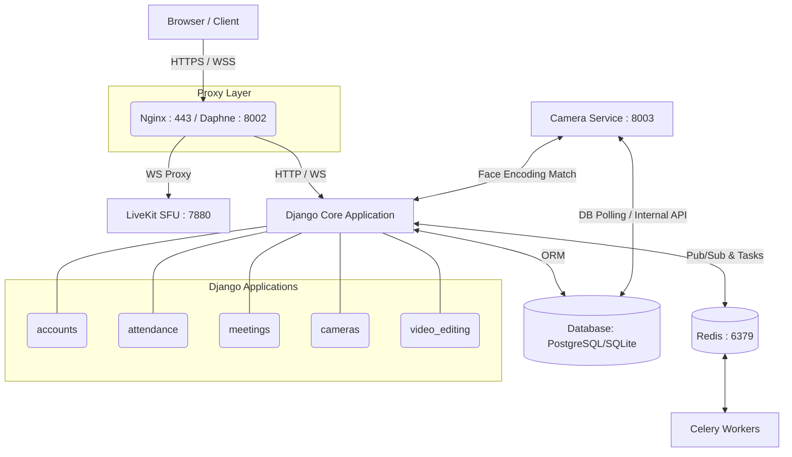

# ⚙️ EduMi 2 — Technical Architecture & System Integration Specification

This document provides a comprehensive technical breakdown of the **EduMi 2** architecture, service orchestration, security frameworks, and implementation patterns.

---

## 1. System Overview & Architecture

EduMi 2 is designed as a hybrid microservice system. The core application runs as an asynchronous Django web app (ASGI) while CPU-bound computer vision/AI operations are offloaded to an isolated Waitress microservice to prevent main-thread blockage.

### Services Topology

---

## 2. Core Service Deep-Dives

### 2.1 Asynchronous Gateway & Real-Time Communication (Daphne & Redis)
- **ASGI Protocol Server**: Daphne runs Twisted under the hood to manage concurrent HTTP, WebSocket, and WebRTC signaling sessions natively.
- **WebSocket Channel Layer**: `channels_redis` handles Pub/Sub routing. Websocket channels enable real-time messaging, attendance sync, and meeting orchestration.
- **Concurrency Strategy**: CPU-bound database writes and external API queries in ASGI consumers are wrapped in `database_sync_to_async` thread pools.

### 2.2 LiveKit SFU (WebRTC Audio/Video)
- **Selective Forwarding Unit (SFU)**: Instead of peer-to-peer mesh routing (which degrades over 4 users), LiveKit manages downstream/upstream allocations.
- **Client-Side Track Registry (`TrackManager`)**:
  Clients utilize a centralized `TrackManager` component inside the browser workspace. This prevents duplicate media attachment loops (which cause browser `AbortError` failures) by tracking unique `publication.trackSid` keys. Screen sharing tracks are cleanly isolated into dedicated DOM nodes (`screen-box-{identity}`) separate from webcams.

---

## 3. Biometric Security & Encryption

Face embeddings represent highly sensitive personal information. Storing raw biometrics in plaintext is a critical security vulnerability.

### Encryption Pipeline
1. **Enrollment**: During face registration, the browser captures frame data and sends it to the server.
2. **Vector Extraction**: `dlib` maps the facial coordinates into a 128-dimensional floating-point vector.
3. **AES-256 (Fernet) Encryption**: The vector JSON is encrypted in memory using symmetric AES-256 encryption via the `cryptography.fernet` library. The key is managed externally via the system environment (`FACE_ENCRYPTION_KEY`).
4. **Decryption**: During active classroom attendance matching, vectors are decrypted in memory for Euclidean distance comparison (`FACE_MATCH_THRESHOLD`) and never saved or logged in plaintext format.

---

## 4. Non-Destructive Video Editing Architecture

EduMi 2 implements a non-destructive edit timeline to eliminate CPU rendering overhead during drafts and prevent generation loss on source material.

### Conceptual Workflow
- **Metadata Timeline**: Actions such as `trim`, `mute`, `rotate`, or `text_overlay` are stored as structural records in `VideoEditAction` models.
- **Real-Time Preview**: The client-side timeline parser dynamically calculates playback boundaries. If an editor removes a middle segment, the playback engine automatically seeks past that time code without writing new files.
- **FFmpeg Filtergraph Compiler**: Upon export, a Celery worker compiles all action metadata into a **single complex filtergraph instruction**. FFmpeg executes the filter graph in a single read/write subprocess, producing a clean final output.

---

## 5. Camera & Computer Vision Microservice (Waitress)

Running computer vision pipelines (dlib, face detection, face recognition) inside the main thread will cause severe request-response lag.

- **Waitress WSGI**: The microservice is hosted via Waitress to handle multiple concurrent MJPEG live surveillance streams on Windows/Linux environments.
- **Continuous Face Voting**: To prevent false positives, attendance is not marked immediately upon face detection. Instead, the consumer tracks consecutive positive matches over a customizable duration (`FACE_PRESENCE_DURATION`), verifying actual student attendance.

---

## 6. Onboarding Runbook for Developers

### Common Troubleshooting Paths

| Error | Primary Cause | Resolution |
|---|---|---|
| **LiveKit 403 / 401 Unauthorized** | Secret key mismatch in `.env` vs `livekit.yaml` | Ensure `LIVEKIT_API_SECRET` has 32+ characters and matches in both configurations. Run LiveKit with `--config`. |
| **`AbortError` on video playback** | Double-subscribing to tracks | Hard-reload the browser (`Ctrl + Shift + R`) to force the latest client-side `TrackManager` cache updates. |
| **Video export job does not complete** | Celery worker inactive | Start the worker task queue: `celery -A school_project worker -l info -P threads` |
| **Camera MJPEG proxy fails** | Waitress Port Blocked | Verify Waitress service is running on port `8003` and not blocked by local system firewalls. |
