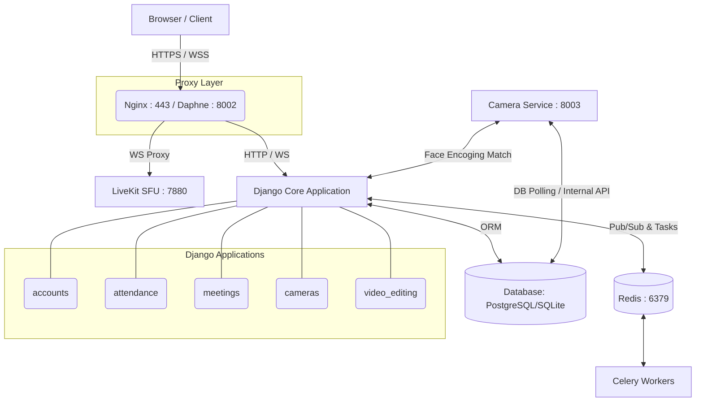

# EduMi 2 - Technical Documentation & Architecture Guide

Welcome to the EduMi 2 technical documentation. This guide is designed to onboard new developers by providing a comprehensive, top-down view of the system architecture. It explains **what** technologies are used, **how** they are integrated, and **why** they were chosen.

---

## 1. System Overview & Architecture

EduMi 2 is a unified, self-hosted educational platform combining virtual classrooms (video conferencing), AI-powered automated attendance, real-time engagement analytics, and a non-destructive video editor.

### Architecture Diagram

---

## 2. Core Technology Stack Deep-Dive

### Web Framework: Django 4.2 (Python 3.11+)
- **Why:** Django provides a robust ORM, built-in admin panel, and excellent security defaults.
- **How:** The project is split into isolated apps (e.g., `attendance`, `video_editing`). Data models are highly normalized. For instance, the video editing engine relies heavily on `VideoEditSession` and `VideoEditAction` models to track changes without altering source files.

### Real-Time Communication: Django Channels & Redis
- **Why:** WebSockets are mandatory for live classrooms (chat, live notifications, real-time face matching).
- **How:** 
  - Django Channels extends Django into the async world. 
  - Redis (`channels-redis`) acts as the channel layer.
  - *Deep Dive:* Look at `attendance/consumers.py` (`FaceAttendanceConsumer`). It receives base64 frames over WebSockets, runs them through a thread-pool executor (`database_sync_to_async`) for CPU-bound face recognition, and uses a rolling vote buffer (requires $N$ consecutive matches) before marking attendance to prevent false positives.

### Web Servers & HTTPS Pipeline
- **Development (Daphne):** Daphne runs directly on port `8002` and uses Twisted to serve **HTTPS** and **WSS** natively using self-signed certificates (`certs/edumi.crt`).
- **Production (Nginx + Docker):** Nginx runs on port `443` (HTTPS). It terminates SSL and proxies unencrypted traffic to Daphne on port `8002`. Secure WebSocket upgrades (`/ws/`) are handled at the Nginx block.

### Video Conferencing: LiveKit (WebRTC SFU)
- **Why:** Peer-to-Peer WebRTC degrades rapidly with more than 4 users. LiveKit is an SFU (Selective Forwarding Unit) that handles scalable video routing.
- **How:** LiveKit runs as an independent binary/container on port `7880`. The Django app communicates with it via the `livekit-api` package to generate JWT tokens. Clients connect to the SFU using these tokens.

---

## 3. The AI & Camera Microservice (Port 8003)

Computer vision operations (OpenCV, `dlib`, `face_recognition`) block the main thread. To solve this, EduMi 2 offloads AI processing to a separate WSGI service.

### Waitress WSGI Server (`camera_service/serve.py`)
- **Why Waitress?** It supports multiple concurrent threads on Windows, allowing it to hold multiple MJPEG streams open simultaneously without blocking.
- **How it works:**
  - Connects directly to RTSP streams or mobile IP cameras.
  - Runs real-time head counting and face detection.
  - Exposes an internal HTTP API that the main Django app queries.

---

## 4. Biometric Security & Encryption (`attendance/encryption_service.py`)

Storing biometric data (face embeddings) in plaintext is a severe privacy risk.

- **The Flow:**
  1. A student registers their face in the browser. 
  2. The server extracts a 128-dimensional vector encoding (via `dlib`).
  3. `FaceEncryptionService` serializes the vector to JSON and encrypts it using `cryptography.fernet` (AES-256) using the `FACE_ENCRYPTION_KEY` environment variable.
  4. The encrypted blob is stored in `StudentFaceProfile.face_embedding_encrypted`.
  5. During attendance checks (`FaceAttendanceConsumer`), the blob is pulled from the DB, decrypted in memory, and matched against the live camera frame.

---

## 5. Non-Destructive Video Editing (`video_editing/models.py`)

Instead of rendering a video multiple times (causing generation loss and high CPU overhead), EduMi 2 uses a non-destructive pipeline.

- **Data Models:**
  - `VideoEditSession`: Tracks a draft edit sequence.
  - `VideoEditAction`: Represents a single ordered action (e.g., `trim`, `mute`, `add_text`). Parameters are stored flexibly in a `JSONField`.
- **Execution:**
  - When the user clicks "Export", a Celery background task (`celery -A school_project worker`) is triggered.
  - The task translates the ordered `VideoEditAction` objects into a **single, complex FFmpeg filtergraph command**.
  - FFmpeg executes the command in a `subprocess`, processing the original file into a final product in a single pass.

---

## 6. Project Directory Guide for Developers

- `school_project/`: The core Django configuration, ASGI/WSGI entry points, and Celery app initialization.
- `accounts/`: Role-based authentication (Admin, Teacher, Student) and profile views.
- `attendance/`: Face-recognition models, WebSocket consumers (`consumers.py`), and AES encryption services.
- `meetings/`: LiveKit integration, meeting room creation, and token generation.
- `cameras/` & `mobile_cameras/`: Hardware IP camera proxying logic.
- `video_editing/`: Non-destructive editor models, Celery tasks for FFmpeg execution.
- `camera_service/`: The dedicated Waitress-powered AI microservice.

---

## Quick Troubleshooting

1. **AI / Camera Streams Failing:** Check the `camera_service` on port 8003. Ensure Waitress is running with enough threads.
2. **WebSockets Disconnecting:** Look at Django Channels, Redis (`channels-redis`), or the Daphne server logs.
3. **Video Calls Failing:** Ensure the `LIVEKIT_API_KEY` and secret match in both `.env` and `config/livekit.yaml`. Check LiveKit logs on port 7880.
4. **Export Video Sticking:** Check if the Celery worker is running (`celery -A school_project worker`) and connected to Redis.
