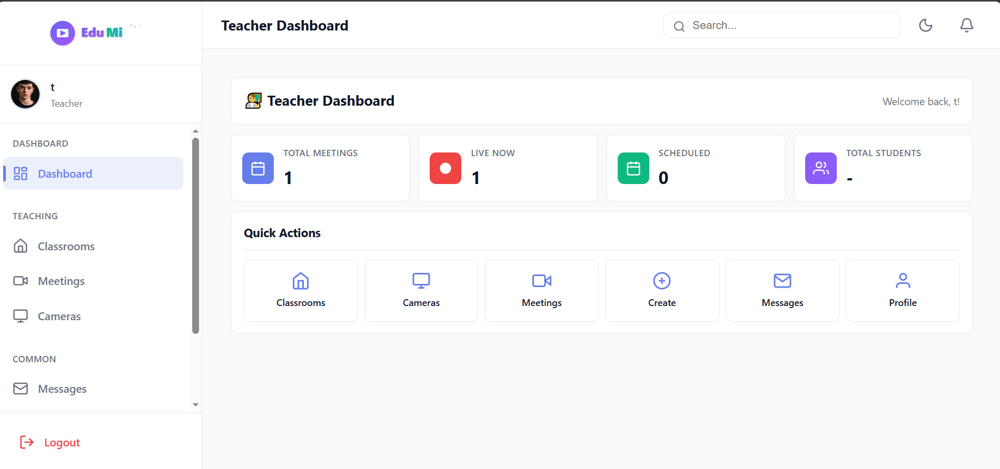
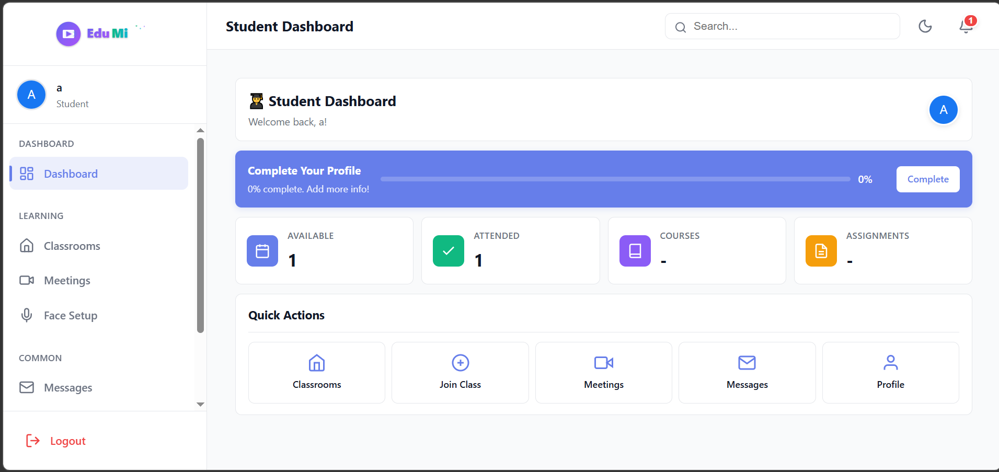
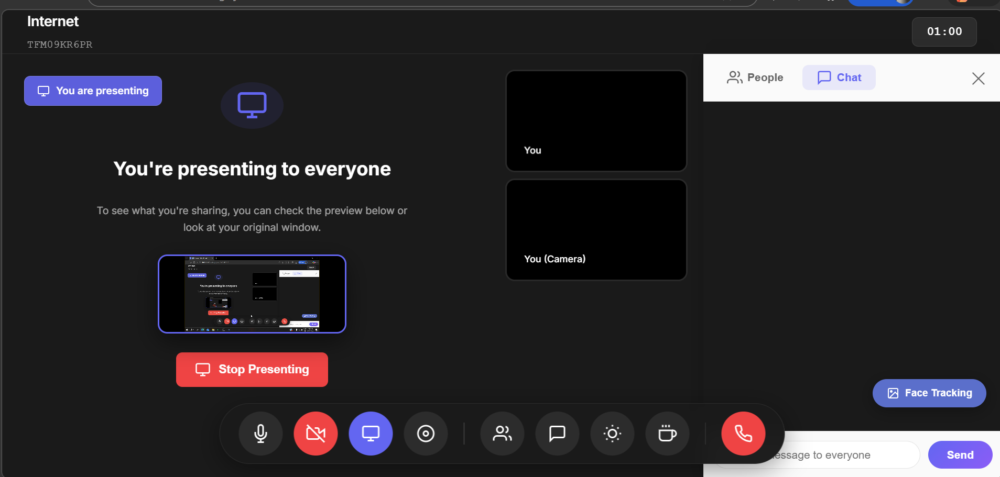

# Edumi Platform: System Overview

## 1. Introduction

Edumi is a real-time video conferencing platform designed for educational institutions. It provides a comprehensive suite of tools for conducting online classes, managing users, tracking attendance, and monitoring classrooms. The platform is built on a microservices architecture using Django, WebRTC, and OpenCV.

## 2. Core Features

### 2.1. User Management

*   **Role-Based Access Control**: The platform supports three user roles: **Admin**, **Teacher**, and **Student**. Each role has a specific set of permissions and a dedicated dashboard.
*   **User Profiles**: Users can create and manage their profiles, including personal information, profile pictures, and social links.
*   **Authentication**: Secure user authentication with login, logout, and registration functionality.
*   **Admin Panel**: A comprehensive admin panel for managing users, meetings, and cameras.
*   **User Directory**: A directory for searching and viewing user profiles.
*   **Private Messaging**: A built-in messaging system for private conversations between users.

### 2.2. Classroom and Meeting Management

*   **Virtual Classrooms**: Teachers can create and manage virtual classrooms with unique class codes and passwords.
*   **Student Enrollment**: Students can request to join a classroom, and teachers can approve or deny their requests.
*   **Meeting Management**: Teachers can create and manage standalone meetings or meetings within a classroom.
*   **Real-Time Video Conferencing**: High-definition video conferencing with screen sharing, powered by WebRTC.
*   **In-Meeting Chat**: A real-time chat feature for communication during meetings.
*   **Meeting Attendance**: The system tracks meeting attendance and provides detailed reports.
*   **Meeting Summaries**: AI-powered meeting summaries are generated after each meeting.
*   **Sleep Mode**: A feature to pause and resume meetings.

### 2.3. Attendance and Engagement Tracking

*   **Facial Recognition**: The platform uses facial recognition to automate attendance tracking.
*   **Secure Face Profiles**: Student face embeddings are securely stored and encrypted.
*   **Attendance Reports**: Detailed attendance reports for teachers, including daily and student-specific views.
*   **Manual Override**: Teachers can manually override attendance records.
*   **Engagement Tracking**: The system tracks student engagement during meetings by analyzing their facial expressions and head poses.
*   **Engagement Reports**: Detailed engagement reports are generated after each meeting, providing insights into student participation.

### 2.4. Camera Management and Head Counting

*   **RTSP Camera Integration**: The platform supports the integration of RTSP cameras for live classroom monitoring.
*   **Camera Permissions**: Admins can grant teachers permission to access specific cameras.
*   **Live Monitoring**: Users can view live camera feeds in a grid, with real-time head-counting annotations.
*   **Head Counting**: The system can automatically count the number of people in a room using the camera feed.
*   **Head Count Reports**: Detailed head count reports and logs are available for analysis.

## 3. User Roles and Workflows

### 3.1. Admin

*   **Dashboard**: The admin dashboard provides an overview of the entire system, including user statistics, meeting statistics, and camera status.
*   **User Management**: Admins can create, edit, and delete users of all roles.
*   **Camera Management**: Admins can add, configure, and delete RTSP cameras. They can also manage camera permissions for teachers.
*   **System Monitoring**: Admins can monitor live meetings and camera feeds.

### 3.2. Teacher

*   **Dashboard**: The teacher dashboard provides an overview of their classrooms, meetings, and students.
*   **Classroom Management**: Teachers can create and manage their classrooms, including student enrollment.
*   **Meeting Management**: Teachers can create and manage meetings, both within and outside of classrooms.
*   **Attendance Tracking**: Teachers can view attendance reports, override attendance records, and configure attendance settings for their classrooms.
*   **Engagement Monitoring**: Teachers can view engagement reports to gain insights into student participation.
*   **Camera Access**: Teachers can view the live feeds of cameras they have been granted permission to access.

### 3.3. Student

*   **Dashboard**: The student dashboard provides an overview of their enrolled classrooms and upcoming meetings.
*   **Classroom Enrollment**: Students can join classrooms using a class code and password.
*   **Meeting Participation**: Students can join and participate in online meetings.
*   **Attendance Viewing**: Students can view their own attendance records.
*   **Face Registration**: Students can register their face for automated attendance tracking.

## 4. Screenshots

### 4.1. Teacher Dashboard

**Description**: The teacher dashboard provides a centralized view of their classrooms, upcoming meetings, and recent activity. It also displays key statistics, such as the number of students and active meetings.

### 4.2. Student Dashboard

**Description**: The student dashboard provides students with an overview of their enrolled classrooms, upcoming meetings, and recent grades. It also includes a progress tracker to help them stay on top of their coursework.

### 4.3. Admin Panel

**Description**: The admin panel gives administrators a comprehensive overview of the entire platform. It includes statistics on user activity, meeting engagement, and system health. Admins can also manage users, cameras, and other system settings from this panel.

### 4.4. Meeting Room

**Description**: The meeting room is where online classes take place. It features a grid view of all participants, a chat window for real-time communication, and controls for screen sharing, muting, and other meeting functions.

## 5. Technical Architecture

*   **Backend**: The platform is built with the Django framework and Python.
*   **Real-Time Communication**: Django Channels and WebSockets are used for real-time features like video conferencing and chat.
*   **Video Processing**: WebRTC is used for real-time video streaming, and OpenCV is used for facial recognition and head counting.
*   **Database**: The platform uses SQLite for development and is ready to be deployed with PostgreSQL in production.
*   **Frontend**: The frontend is built with HTML, CSS, and JavaScript.
*   **Microservices**: The platform follows a microservices architecture, with a separate service for camera management.
