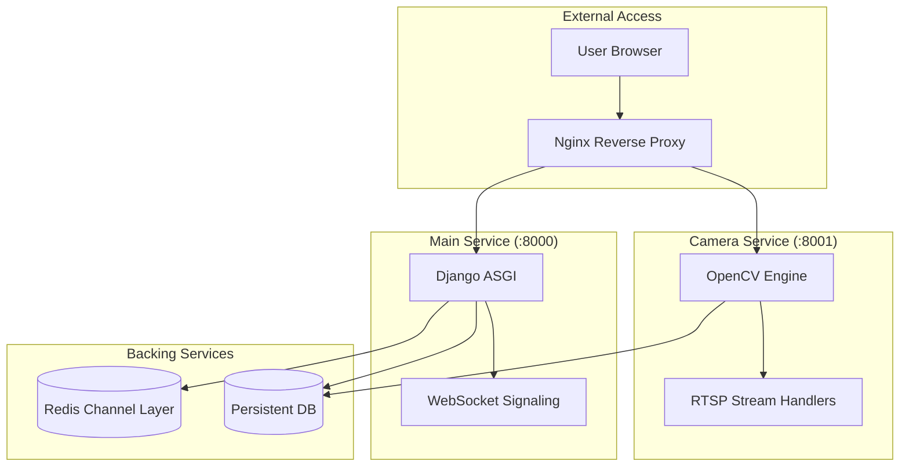

# 📑 EduMi Technical Documentation & System Specification
## Version 1.0 | Stable

---

## 1. Executive Summary
EduMi is a state-of-the-art, real-time educational platform designed for schools and universities. It integrates high-concurrency video conferencing with institutional management features, utilizing a microservices architecture to segregate mission-critical video processing from administrative logic.

### Core Objectives:
- **Zero-Latency Communication**: Leveraging WebRTC for peer-to-peer media transport.
- **Scalable Monitoring**: Dedicated microservice for camera processing and RTSP streaming.
- **Institutional Persistence**: Persistent classrooms with membership-based access control.
- **Automated Intelligence**: AI-powered meeting summarization and attendance tracking.

---

## 2. System Architecture (Deep Dive)
EduMi utilizes a hybrid architectural pattern combining a monolithic Django core with specialized microservices.

### 🎥 Architectural Components:
1.  **Main Application Layer (Port 8000)**:
    - **Engine**: Django + ASGI (Daphne).
    - **Signaling Server**: Django Channels managing WebSocket protocols for WebRTC negotiation.
    - **Business Logic**: Authentication, 2FA, Meeting Scheduling, Classroom Management.
2.  **Camera Microservice (Port 8001)**:
    - **Engine**: Lightweight Django (WSGI).
    - **Processing**: OpenCV-powered RTSP transcoding and frame-serving.
    - **Isolation**: Prevents video processing overhead from impacting the main site’s responsiveness.
3.  **Real-time Data Layer**:
    - **Broker**: Redis act as the channel layer for WebSockets and task broker for Celery.
    - **Storage**: SQLite (Dev) / PostgreSQL (Prod) for persistent state.

---

## 3. Technology Stack Specification

| Tier | Technology | Rationale |
| :--- | :--- | :--- |
| **Backend Framework** | Django 4.2.9 | Robust ORM, Security-first design, mature ecosystem. |
| **Real-time Layer** | Django Channels 4.0 | Seamless integration of WebSockets into the Django pipeline. |
| **Media Transport** | WebRTC | Direct peer-to-peer low-latency encrypted video/audio streaming. |
| **Task Queue** | Celery + Redis | Offloading long-running tasks like AI summary generation. |
| **Video Engine** | OpenCV | Industry-standard library for computer vision and RTSP handling. |
| **Security** | Django OTP (2FA) | Two-factor authentication for enhanced institutional security. |
| **Containerization** | Docker + Compose | Guaranteed environment consistency across development and production. |

---

## 4. Fundamental Logic Flows

### 4.1. WebRTC Signaling Flow
1.  **Initiation**: User joins a meeting room via WebSocket (`/ws/meeting/<code_id>/`).
2.  **Offer/Answer**: Participant A sends a WebRTC "Offer" through the WebSocket Signaling Server.
3.  **Routing**: The Signaling Server (Django Channels) routes the packet to Participant B.
4.  **ICE Negotiation**: Interactive Connectivity Establishment (ICE) candidates are exchanged to find the shortest network path (P2P).
5.  **Direct Stream**: Media flows directly between browsers, bypassing the server to reduce costs and latency.

### 4.2. Camera Microservice Flow
1.  **Request**: Main App requests a live feed for a specific IP camera.
2.  **Process**: Camera Service (:8001) initiates an OpenCV capture loop for the RTSP URL.
3.  **Stream**: Frames are served as an MJPEG stream, optimized for low-latency web viewing without heavy transcoding.

---

## 5. Data Model Architecture

The database schema is designed for high relational integrity:
- **Classroom**: The root container for persistence. Has `class_code` for easy entry.
- **ClassroomMembership**: Bridges Users and Classrooms with `status` (pending, approved, denied).
- **Meeting**: A temporal session linked to a Classroom. Tracks `status` (live, ended).
- **MeetingParticipant**: Intersection table tracking specific user engagement and duration in a meeting.
- **MeetingAttendanceLog**: Immutable log for audit-ready attendance reporting.
- **MeetingSummary**: Stores JSON-structured key points and AI-generated text post-meeting.

---

## 6. Security Protocol

### 6.1. Authentication & 2FA
EduMi implements a multi-layered security model:
- **Standard Auth**: Django’s built-in session-based authentication.
- **TOTP (Time-based One-Time Password)**: Powered by `django-two-factor-auth`, requiring a second device for login.
- **Role-Based Access (RBAC)**: Strict separation between `teacher` and `student` profiles via `UserProfile` extension.

### 6.2. Network Security
- **Cross-Origin Resource Sharing (CORS)**: Strictly configured between Main and Camera services.
- **CSRF Protection**: Token-based protection on all POST operations.
- **HTTPS Enforcement**: WebRTC requires SecureContext; the app includes scripts for local OpenSSL certificates and production-ready Nginx configs.

---

## 7. Developer & DevOps Guide

### 7.1. Directory Structure
- `/accounts`: Identity management and profile logic.
- `/meetings`: Core video/classroom logic and signals.
- `/camera_service`: Independent microservice for video hardware integration.
- `/static`: Modular CSS (Sidebar, Meeting Room, Dashboard) and JS.
- `/docs`: Detailed setup and maintenance guides.

### 7.2. Production Deployment
1.  **Environment Configuration**: Copy `.env.example` to `.env` and configure `SECRET_KEY`, `ALLOWED_HOSTS`, and `REDIS_URL`.
2.  **Containerization**: Run `docker-compose up --build -d`. This spawns the Web, Redis, and Camera services.
3.  **Reverse Proxy**: Configure Nginx to route traffic to `:8000` (app) and `:8001` (camera) while handling SSL termination.

### 7.3. Maintenance Recommendations
- **Database Scaling**: Switch to PostgreSQL in `settings.py` for distributed environments.
- **Signal Integrity**: Periodically monitor Redis memory usage for large numbers of concurrent WebSockets.
- **AI Upgrades**: The `meetings/tasks.py` is configured as a hook for LLM integration (OpenAI/Anthropic) for generating deeper educational summaries.

---
*Documentation Compiled by Antigravity AI - System Optimization Complete.*
